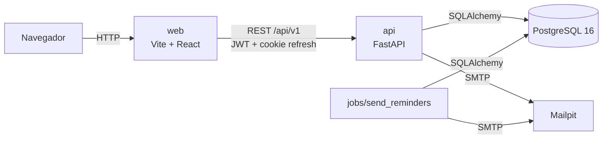
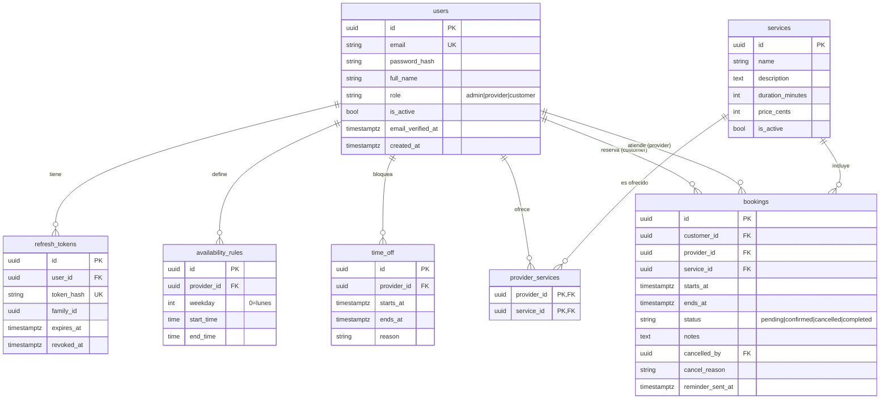
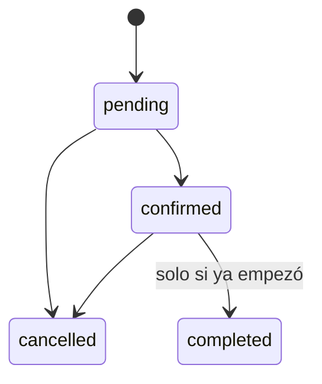

# Turnos — plataforma de reservas

[](https://github.com/jasserav7/turnos-booking-platform/actions/workflows/ci.yml)
[](LICENSE)

Aplicación web multi-rol donde los clientes reservan citas con profesionales. Incluye disponibilidad semanal, bloqueos, flujo de estados de la reserva, correos transaccionales, recordatorios y un panel de administración. Tema claro/oscuro y diseño responsive.

## Funcionalidades por rol

| Rol | Funcionalidades |
|---|---|
| **Cliente** | Registro y verificación de correo, recuperación de contraseña, ver servicios y profesionales, elegir un horario libre, reservar, ver sus reservas y cancelarlas hasta `CANCEL_MIN_HOURS` antes. |
| **Profesional** | Gestionar su disponibilidad semanal y bloqueos (`time_off`), ver su agenda por día o semana, confirmar, cancelar y completar las reservas que le corresponden. |
| **Admin** | CRUD de servicios (desactivar en lugar de borrar), asignar servicios a profesionales, gestionar usuarios (rol, activo), ver todas las reservas y métricas. |

El registro público solo crea clientes. El primer admin sale del script `seed`; los profesionales los crea o promueve un admin.

## Stack

- **Backend:** Python 3.12, FastAPI, SQLAlchemy 2.0 (síncrono), Alembic, Pydantic v2, PostgreSQL 16, PyJWT, argon2 (`pwdlib`), slowapi, Jinja2 y `smtplib` para el correo.
- **Frontend:** Vite, React, TypeScript estricto, Tailwind CSS, React Router, TanStack Query, react-hook-form + zod, date-fns. Sin librerías de componentes. Los tipos de la API se generan con `openapi-typescript` (`frontend/src/api/schema.d.ts`, versionado).
- **Infra:** Docker Compose (`db`, `mailpit`, `api`, `web`) y GitHub Actions.

## Decisiones técnicas destacadas

- **Anti doble reserva en la base de datos.** Un constraint de exclusión de PostgreSQL (`btree_gist` + `tstzrange`) impide solapar reservas `pending`/`confirmed` del mismo profesional, incluso bajo concurrencia. La violación se traduce a `409 slot_unavailable`.
- **Refresh tokens con rotación y detección de reutilización.** El token de refresh vive en una cookie `httpOnly`, se guarda como sha256 y se rota en cada uso; si se reutiliza uno revocado, se revoca toda su familia (`family_id`). El access token (15 min) solo existe en memoria del frontend.
- **Generación de slots como función pura.** `services/slots.py` calcula los horarios a partir de reglas, bloqueos y reservas, sin tocar la base de datos, lo que la hace trivial de testear.
- **Correos fuera de la transacción.** Las notificaciones se envían después del `commit`; un fallo de SMTP nunca revierte una reserva.
- **Horas en UTC, reglas en zona local.** La base guarda `timestamptz` en UTC; la disponibilidad se interpreta en `APP_TIMEZONE` (por defecto `America/Bogota`).
- **Autorización en dos capas:** `require_roles(...)` en los routers y comprobación de propiedad en los servicios.

Las decisiones ambiguas están registradas en [`docs/DECISIONS.md`](docs/DECISIONS.md).

## Arquitectura



## Modelo de datos



Estados de una reserva:



## Puesta en marcha con Docker

Requisitos: Docker y Docker Compose.

```bash
git clone https://github.com/jasserav7/turnos-booking-platform.git
cd turnos-booking-platform
cp .env.example .env        # PowerShell: Copy-Item .env.example .env
docker compose up --build
```

Al arrancar, la API aplica las migraciones y crea el admin definido en `ADMIN_EMAIL` / `ADMIN_PASSWORD`.

| Servicio | URL |
|---|---|
| Aplicación web | http://localhost:5173 |
| API (docs interactivas) | http://localhost:8000/docs |
| Mailpit (correos de prueba) | http://localhost:8025 |
| PostgreSQL | `localhost:5433` (usuario, clave y base: `turnos`) |

Para cargar los datos de demostración (opcional, idempotente):

```bash
docker compose exec api python -m app.scripts.seed_demo
```

Para enviar los recordatorios de reservas próximas (pensado para un cron):

```bash
docker compose exec api python -m app.jobs.send_reminders
```

## Puesta en marcha sin Docker

Requisitos: Python 3.12, Node LTS y un PostgreSQL 16 accesible. Crea las bases `turnos` y `turnos_test` y ajusta `DATABASE_URL` / `TEST_DATABASE_URL` en `.env`. Para tener solo la base y el servidor de correo puedes usar `docker compose up db mailpit`.

```bash
# Backend
cd backend
python -m venv .venv
.venv/Scripts/activate        # Linux/macOS: source .venv/bin/activate
pip install -e ".[dev]"
alembic upgrade head
python -m app.scripts.seed
uvicorn app.main:app --reload

# Frontend (otra terminal)
cd frontend
cp .env.example .env          # PowerShell: Copy-Item .env.example .env
npm ci
npm run dev
```

Si cambias la API, regenera los tipos con la API en marcha: `npm run gen:api` (en `frontend/`).

## Variables de entorno

Se definen en `.env` (plantilla en [`.env.example`](.env.example)). Nada de secretos en el código.

| Variable | Descripción |
|---|---|
| `DATABASE_URL` / `TEST_DATABASE_URL` | Conexión a la base principal y a la de tests. |
| `SECRET_KEY` | Clave para firmar los JWT. **Cámbiala en producción.** |
| `APP_TIMEZONE` | Zona horaria de las reglas de disponibilidad (`America/Bogota`). |
| `CORS_ORIGINS` | Orígenes permitidos, separados por comas. |
| `COOKIE_SECURE` | `true` en producción (HTTPS) para la cookie de refresh. |
| `FRONTEND_URL` | URL base del frontend, usada en los enlaces de los correos. |
| `SMTP_HOST`, `SMTP_PORT`, `SMTP_USER`, `SMTP_PASSWORD`, `SMTP_FROM`, `SMTP_STARTTLS` | Configuración del correo (Mailpit en desarrollo). |
| `ADMIN_EMAIL` / `ADMIN_PASSWORD` | Credenciales del primer admin creado por `seed`. |
| `MIN_NOTICE_MINUTES` | Antelación mínima para reservar (60). |
| `BOOKING_HORIZON_DAYS` | Horizonte máximo de reserva (60). |
| `CANCEL_MIN_HOURS` | Horas mínimas antes de la cita para que el cliente cancele (2). |
| `VITE_API_URL`, `VITE_APP_TIMEZONE` | Frontend: URL de la API y zona horaria. |

## Tests y calidad

```bash
# Backend (necesita PostgreSQL y TEST_DATABASE_URL)
cd backend
ruff check .
pytest

# Frontend
cd frontend
npx tsc --noEmit
npm run lint
npm run build
```

El workflow [`ci.yml`](.github/workflows/ci.yml) ejecuta todo esto en cada push a `main` y en cada pull request.

## Credenciales de demo

Tras ejecutar `seed_demo`, todos los usuarios tienen la contraseña **`Demo12345!`**:

| Rol | Correo |
|---|---|
| Admin | `admin@demo.turnos.local` |
| Profesional | `laura@demo.turnos.local` |
| Profesional | `andres@demo.turnos.local` |
| Cliente | `cliente@demo.turnos.local` |

Además existe el admin del `seed`, con las credenciales de `ADMIN_EMAIL` / `ADMIN_PASSWORD` (en `.env.example`: `admin@turnos.local` / `Admin12345!`). **Son solo para desarrollo.**

Los datos demo incluyen 5 servicios, disponibilidad semanal para los dos profesionales y reservas de ejemplo en estado pendiente, confirmada, cancelada y completada.

## Capturas

<!-- Añadir las imágenes en docs/img/ -->

| | |
|---|---|
|  |  |
|  |  |
|  |  |

## Roadmap

- Pasarela de pagos y depósitos al reservar.
- Recordatorios por SMS / WhatsApp.
- Sincronización con Google Calendar / iCal.
- Reseñas y valoraciones de los profesionales.
- Disponibilidad por fechas concretas y reservas recurrentes.
- Internacionalización (i18n) y zona horaria por usuario.

## Licencia

[MIT](LICENSE)
